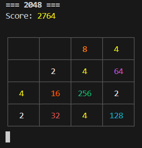
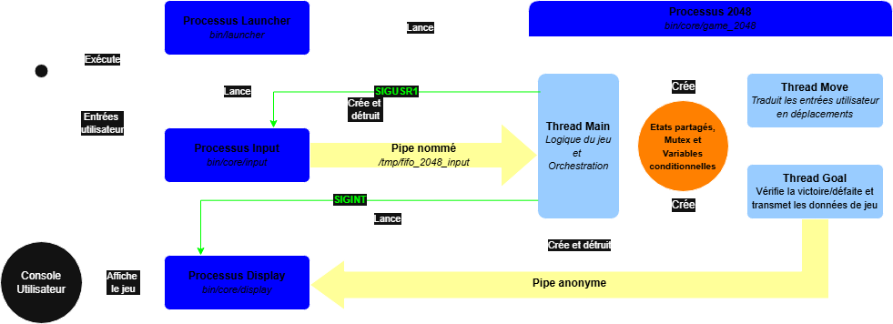

# SAE 2048 

**SAE 2048** est un projet de 2e année de **BUT Informatique à l’IUT d’Illkirch** développé en C dont le but est de reproduire le célèbre jeu **2048**.
Il met en oeuvre une **séparation stricte des responsabilités** via plusieurs **processus** (Entrée, Jeu, Affichage) et **threads**, communiquant entre eux par des **pipes** (nommés et anonymes) et des **signaux**.

## Captures d'écran

### Interface de jeu (Console)


### Architecture Système


## Technologies utilisées

* **Langage :** C (Standards POSIX)
* **Concepts :** Processus, Threads (pthreads), Pipes, Signaux, Mutex, CondVars, SigAtomic
* **IDE :** Visual Studio Code

## Équipe

* Nombre de développeurs : **3**
* Durée du projet : 3 semaines

## Installation et exécution

1. **Cloner le dépôt :**
```bash
git clone https://github.com/D-l-E-G-O/SAE-2048.git
cd SAE-2048
```


2. **Compilation :**
```bash
make
```


3. **Préparation de l'environnement :**
Le jeu utilise un *pipe nommé* pour la communication. Le script ou le programme se charge généralement de le créer, mais assurez-vous que le dossier `/tmp` est accessible.


4. **Lancer le jeu :**
Le lancement est automatisé via un exécutable launcher qui se charge de démarrer le moteur et le contrôleur.
```bash
./bin/launcher
```


> [!IMPORTANT]
> Ce projet repose sur des **mécanismes IPC (Inter-Process Communication)** spécifiques à Linux/Unix. Il ne fonctionnera pas nativement sous Windows sans un environnement type WSL (Windows Subsystem for Linux).

## Fonctionnalités principales

- **Architecture Multi-processus :** Séparation distincte entre la gestion des entrées (Main), la logique du jeu (2048) et le rendu visuel (Affichage).
 
- **Gestion Multi-threads :** Le coeur du jeu utilise 3 threads dédiés pour :
    - L'orchestration et la réception des commandes (Main)

    - Le calcul des mouvements (Move)

    - La vérification des conditions de victoire et l'envoi des données à l'affichage (Goal)

- **Communication et Synchronisation :**
 
    - **Pipe Nommé (FIFO) :** Canal de transmission unidirectionnel pour envoyer les commandes du joueur (Input) vers le moteur de jeu.
 
    - **Pipe Anonyme :** Flux de données continu permettant au moteur d'envoyer l'état de la grille au processus d'affichage en temps réel.

    - **Signaux (SIGINT, SIGUSR1) :** Coordination événementielle entre les processus (pour l'arrêt propre) et interruption des appels bloquants.

    - **Mutex et Variables Conditionnelles :** Mécanismes de synchronisation inter-threads assurant l'exclusion mutuelle sur les données partagées (état du jeu) et l'orchestration séquentielle des tâches (Input -> Move -> Goal).

- **Algorithme de jeu complet :** Gestion des fusions, apparition aléatoire de tuiles (2 ou 4) et détection de Game Over/Victoire.
