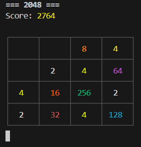
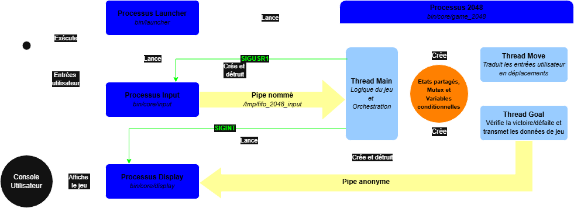

# SAE 2048 

**SAE 2048** est un projet de 2e année de **BUT Informatique à l’IUT d’Illkirch** développé en C dont le but est de reproduire le célèbre jeu **2048**.
Initialement conçu comme un jeu local, le projet a évolué vers une **architecture client-serveur multijoueur** permettant de jouer plusieurs parties en parallèle sur un même moteur. Il met en œuvre une séparation stricte des responsabilités via de multiples processus et threads, exploitant la mémoire partagée pour la logique de calcul.

## Captures d'écran

### Interface de jeu (Console)


### Architecture Système


## Technologies utilisées

* **Langage :** C (Standards POSIX)
* **Concepts :** Processus, Threads (pthreads), Mémoire Partagée (System V SHM)
* **Synchronisation :** Mutex, Sémaphores, Signaux (SIGINT, SIGUSR2, etc.)
* **Communication (IPC) :** Pipe nommé (FIFO) et Pipes anonymes
* **Structures dynamiques :** Implémentation d'une structure array_list
* **IDE :** Visual Studio Code

## Équipe

* Nombre de développeurs : **3**
* Durée du projet : 4 semaines

## Installation et exécution

1. **Cloner le dépôt :**
```bash
git clone https://github.com/D-l-E-G-O/SAE-2048.git
cd SAE-2048
```


2. **Compilation :**
```bash
make
```


3. **Préparation de l'environnement :**
Le jeu utilise un *pipe nommé* pour la communication. Le script ou le programme se charge généralement de le créer, mais assurez-vous que le dossier `/tmp` est accessible.


4. **Lancer le jeu :**
Le processus central peut accueillir jusqu'à `N` parties simultanées. Ouvrez un terminal pour lancer le serveur (exemple pour une limite de 5 joueurs) :
```bash
./bin/game_2048 5
```

Ouvrez ensuite autant de nouveaux terminaux que de joueurs souhaités et lancez un client (contrôleur) dans chacun d'eux :
```bash
./bin/input
```

> [!IMPORTANT]
> Ce projet repose sur des **mécanismes IPC (Inter-Process Communication)** spécifiques à Linux/Unix. Il ne fonctionnera pas nativement sous Windows sans un environnement type WSL (Windows Subsystem for Linux).


## Architecture et Fonctionnalités

- **Architecture Client-Serveur :** Un unique processus moteur gère la logique globale, tandis que plusieurs processus clients récupèrent de manière isolée les entrées des utilisateurs.

- **Mémoire Partagée (SHM) :** Le déplacement des tuiles et le calcul des scores sont strictement confinés et exécutés dans un segment de mémoire partagé protégé.

- **Gestion Multi-threads Dynamique :** Le moteur déploie à la volée des paires de threads "Move" et "Goal" pour traiter jusqu'à `N` parties en parallèle.

- **Canal d'entrée centralisé :** Utilisation d'un unique pipe nommé agissant comme un goulot d'étranglement réseau pour recevoir les commandes de tous les joueurs.

- **Affichage indépendant :** Création dynamique de pipes anonymes pour transmettre l'état du jeu aux processus d'affichage graphiques dédiés à chaque joueur.

- **Synchronisation stricte :** Déploiement de tableaux de Mutex et de Variables Conditionnelles garantissant une exclusion mutuelle parfaite sur les emplacements de calcul.

- **Sécurité système :** Prévention des processus zombies (`waitpid`), fermeture sécurisée des File Descriptors pour éviter les fuites de mémoire, et résistance aux crashs clients (`SIGPIPE`).

- **Algorithme de jeu complet :** Gestion des fusions, apparition aléatoire de tuiles (2 ou 4) et détection de Game Over/Victoire.


## Licence

Ce projet est distribué sous la licence MIT. Voir le fichier `LICENSE` pour plus d'informations.
