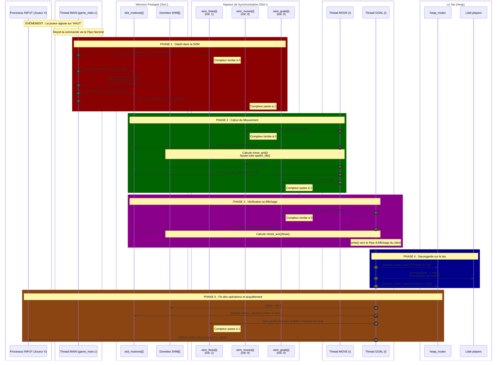

```mermaid

sequenceDiagram
    autonumber
    box 
    participant In as Processus INPUT (Joueur X)
    end
    box 
    participant Main as Thread MAIN (game_main.c)
    end
    box  Mémoire Partagée (Slot i)
    participant SMutex as slot_mutexes[i]
    participant SHM as Données SHM[i]
    end
    box Signaux de Synchronisation (Slot i)
    participant SFree as sem_frees[i]<br/>(Init: 1)
    participant SMove as sem_moves[i]<br/>(Init: 0)
    participant SGoal as sem_goals[i]<br/>(Init: 0)
    end
    box 
    participant TMove as Thread MOVE (i)
    participant TGoal as Thread GOAL (i)
    end
    box  Le Tas (Heap)
    participant HMutex as heap_mutex
    participant Heap as Liste players
    end

    Note over In, Main: ÉVÉNEMENT : Le joueur appuie sur 'HAUT'

    Note over Main: Reçoit la commande via le Pipe Nommé

    rect DarkRed 
    Note over Main, SGoal: PHASE 1 : Dépôt dans la SHM
    Main->>SFree: sem_wait() [Attend que le slot soit IDLE]
    Note right of SFree: Compteur tombe à 0
    Main->>SMutex: pthread_mutex_lock() [Verrouille]
    Main->>SHM: memcpy(Heap -> SHM)<br/>Définit Commande = HAUT<br/>Statut = TO_MOVE
    Main->>SMutex: pthread_mutex_unlock() [Libère]
    Main->>SMove: sem_post() [Réveille le Thread Move]
    Note right of SMove: Compteur passe à 1
    end

    rect DarkGreen
    Note over SMutex, TMove: PHASE 2 : Calcul du Mouvement
    TMove->>SMove: sem_wait() [Est réveillé]
    Note right of SMove: Compteur tombe à 0
    TMove->>SMutex: pthread_mutex_lock() [Verrouille]
    Note over TMove, SHM: Calcule move_grid()<br/>Ajoute tuile spawn_tile()
    TMove->>SHM: Statut = TO_GOAL
    TMove->>SMutex: pthread_mutex_unlock() [Libère]
    TMove->>SGoal: sem_post() [Réveille le Thread Goal]
    Note right of SGoal: Compteur passe à 1
    end

    rect DarkMagenta
    Note over SMutex, TGoal: PHASE 3 : Vérification et Affichage
    TGoal->>SGoal: sem_wait() [Est réveillé]
    Note right of SGoal: Compteur tombe à 0
    TGoal->>SMutex: pthread_mutex_lock() [Verrouille]
    Note over TGoal, SHM: Calcule check_win()/lose()
    Note over TGoal: write() vers le Pipe d'Affichage du client
    end

    rect DarkBlue
    Note over TGoal, Heap: PHASE 4 : Sauvegarde sur le tas
    TGoal->>HMutex: pthread_mutex_lock() [Protège le Tas]
    TGoal->>Heap: memcpy(SHM -> Heap)<br/>(Sauvegarde persitante)
    TGoal->>HMutex: pthread_mutex_unlock() [Libère le Tas]
    end

    rect SaddleBrown
    Note over In, HMutex: PHASE 5 : Fin des opérations et acquittement
    TGoal->>SHM: Statut = IDLE
    TGoal->>SMutex: pthread_mutex_unlock() [Libère le Slot]
    TGoal->>SFree: sem_post() [Autorise le Main à réutiliser ce slot]
    Note right of SFree: Compteur passe à 1
    TGoal->>In: kill(SIGUSR2) [Acquittement au client]
    end
```